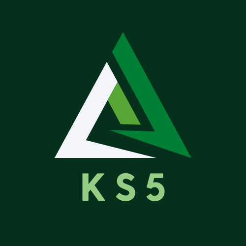

 
 <h2 align="center">Welcome!</h2>

### Hi there 👋 I'm [ks5_dev](https://anandmainali.com.np)
> A hobbyist highschool developer

 

I am 17 year-old kid who find school pretty boring, so I do programming in my free time for fun and so far I have enjoyed it. I'm into Computer Science, game-dev (hobby games, not for profit) and web development. 

### Programming Languages 🌐

|  |   |   |   |  ) |
|---|---|---|---|---|

### Github Stats

### Github Repos

<h3> 🤝🏻 Connect with Me </h3>

|  |  |  |
|---|---|---|

